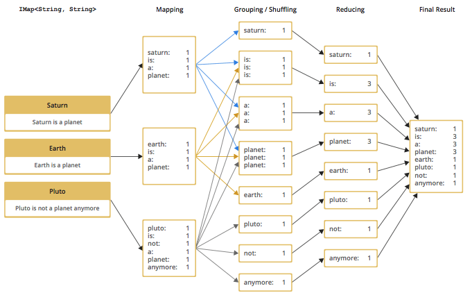

This section will give deeper insight into the MapReduce pattern and will help you understand the semantics behind the different MapReduce phases and how they are implemented in Hazelcast.

In addition to this, the following sections compare Hadoop and Hazelcast MapReduce implementations to help adopters with Hadoop backgrounds quickly get familiar with Hazelcast MapReduce.

#### MapReduce Workflow Example

The flowchart below demonstrates the basic workflow of the word count example (distributed occurrences analysis) mentioned in the introduction section. From left to right, it iterates over all the entries of a data structure (in this case an IMap). In the mapping phase, it splits the sentence into single words and emits a key-value pair per word: the word is the key, 1 is the value. In the next phase, values are collected (grouped) and transported to their
corresponding reducers, where they are eventually reduced to a single key-value pair, the value being the number of occurrences of the word. At the last step, the different reducer results are grouped up to the final result and returned to the requester.



In pseudo code, the corresponding map and reduce function would look like the following. A Hazelcast code example will be shown in the next section.

```plain
map( key:String, document:String ):Void ->
  for each w:word in document:
    emit( w, 1 )

reduce( word:String, counts:List[Int] ):Int ->
  return sum( counts )
```

#### MapReduce Phases

As seen in the workflow example, a MapReduce process consists of multiple phases. The original MapReduce pattern describes two phases (map, reduce) and one optional phase (combine). In Hazelcast, these phases either only exist virtually to explain the data flow, or are executed in parallel during the real operation while the general idea is still persisting.

(K x V)\* -> (L x W)*

[(k*1*, v*1*), ..., (k*n*, v*n*)] -> [(l*1*, w*1*), ..., (l*m*, w*m*)]

**Mapping Phase**

The mapping phase iterates all key-value pairs of any kind of legal input source. The mapper then analyzes the input pairs and emits zero or more new key-value pairs.

K x V -> (L x W)*

(k, v) -> [(l*1*, w*1*), ..., (l*n*, w*n*)]

**Combine Phase**

In the combine phase, multiple key-value pairs with the same key are collected and combined to an intermediate result before being sent to the reducers. **Combine phase is also optional in Hazelcast, but is highly recommended to lower the traffic.**

In terms of the word count example, this can be explained using the sentences "Saturn is a planet but the Earth is a planet, too". As shown above, we would send two key-value pairs (planet, 1). The registered combiner now collects those two pairs and combines them into an intermediate result of (planet, 2). Instead of two key-value
pairs sent through the wire, there is now only one for the key "planet".

The pseudo code for a combiner is similar to the reducer.

```text
combine( word:String, counts:List[Int] ):Void ->
  emit( word, sum( counts ) )
```

**Grouping / Shuffling Phase**

The grouping or shuffling phase only exists virtually in Hazelcast since it is not a real phase; emitted key-value pairs with the same key are always transferred to the same reducer in the same job. They are grouped together, which is equivalent to the shuffling phase.

**Reducing Phase**

In the reducing phase, the collected intermediate key-value pairs are reduced by their keys to build the final by-key result. This value can be a sum of all the emitted values of the same key, an average value, or something completely different, depending on the use case.

Here is a reduced representation of this phase.

L x W\* -> X*

(l, [w*1*, ..., w*n*]) -> [x*1*, ..., x*n*]

**Producing the Final Result**

This is not a real MapReduce phase, but it is the final step in Hazelcast after all reducers are notified that reducing has finished. The original job initiator then requests all reduced results and builds the final result.


#### Additional MapReduce Resources

The Internet is full of useful resources for finding deeper information on MapReduce. Below is a short collection of more introduction material. In addition, there are books written about all kinds of MapReduce patterns and how to write a MapReduce function for your use case. To name them all is out of the scope of this documentation, but here are some resources:

 - <a href="http://research.google.com/archive/mapreduce.html" target="_blank">http://research.google.com/archive/mapreduce.html</a>
 - <a href="http://en.wikipedia.org/wiki/MapReduce" target="_blank">http://en.wikipedia.org/wiki/MapReduce</a>
 - <a href="http://hci.stanford.edu/courses/cs448g/a2/files/map_reduce_tutorial.pdf" target="_blank">http://hci.stanford.edu/courses/cs448g/a2/files/map_reduce_tutorial.pdf</a>
 - <a href="http://ksat.me/map-reduce-a-really-simple-introduction-kloudo/" target="_blank">http://ksat.me/map-reduce-a-really-simple-introduction-kloudo/</a>
 - <a href="http://www.slideshare.net/franebandov/an-introduction-to-mapreduce-6789635" target="_blank">http://www.slideshare.net/franebandov/an-introduction-to-mapreduce-6789635</a>


