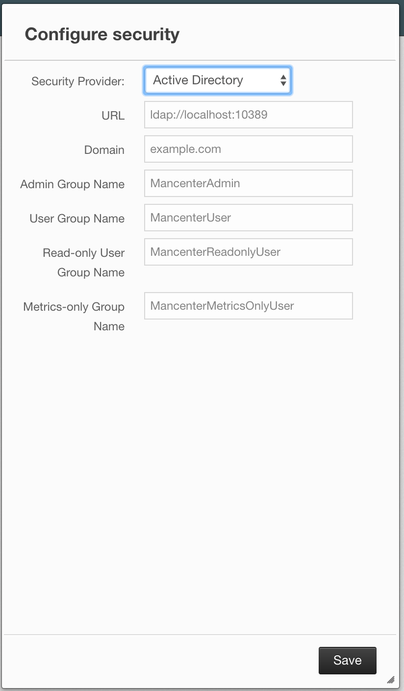

You can use your existing Active Directory server for authentication/authorization on Management Center. In the "Configure Security" page, select **Active Directory** from the "Security Provider" combo, and the following form page appears:

Provide the details in this form for your Active Directory server:
 
- **URL:** URL of your Active Directory server, including schema (`ldap://` or `ldaps://`) and port.
- **Domain:** Domain of your organization on Active Directory.
- **Admin Group Name:** Members of this group will have admin privileges on the Management Center.
- **User Group Name:** Members of this group will have read and write privileges on the Management Center.
- **Read-only User Group Name:** Members of this group will have only read privilege on the Management Center.
- **Metrics-only Group Name:** Members of this group will have the privilege to see only the metrics on the Management Center.
 
Once configured, Active Directory settings are saved in a file named `ldap.properties` under the `mancenter` folder mentioned in the previous section. If you want to update your settings afterwards, you need to update `ldap.properties` file and click "Reload Security Config" button on the login page.