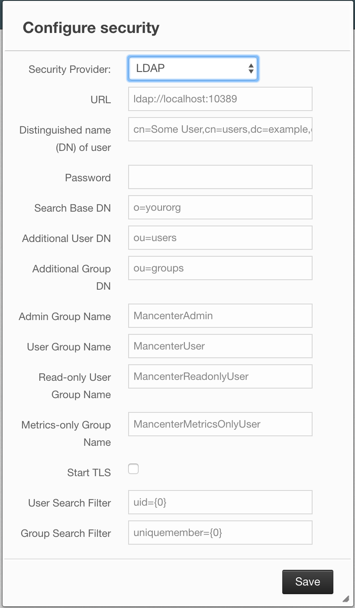

You can use your existing LDAP server for authentication/authorization on Management Center. In the "Configure Security" page, select **LDAP** from the "Security Provider" combo box, and the following form page appears:

Provide the details in this form for your LDAP server:

- **URL:** URL of your LDAP server, including schema (`ldap://` or `ldaps://`) and port.
- **Distinguished name (DN) of user:** DN of a user that has admin privileges on the LDAP server. It is used to connect to the server when authenticating users. 
- **Search base DN:** Base DN to use for searching users/groups.
- **Additional user DN:** Appended to "Search base DN" and used for finding users.
- **Additional group DN:** Appended to "Search base DN" and used for finding groups.
- **Admin Group Name:** Members of this group will have admin privileges on Management Center.
- **User Group Name:** Members of this group will have read and write privileges on Management Center.
- **Read-only User Group Name:** Members of this group will only have read privilege on Management Center.
- **Start TLS:** Enable if your LDAP server uses Start TLS.
- **User Search Filter:** LDAP search filter expression to search for users. For example, `uid={0}` searches for a username that matches with the `uid` attribute.
- **Group Search Filter:** LDAP search filter expression to search for groups. For example, `uniquemember={0}` searches for a group that matches with the `uniquemember` attribute

Once configured, LDAP settings are saved in a file named `ldap.properties` under the `mancenter` folder mentioned in the previous section. If you want to update your settings afterwards, you need to update `ldap.properties` file and click "Reload Security Config" button on the login page.

#### Password Encryption
 
By default, the password that you use in LDAP configuration is saved on the `ldap.properties` file in clear text. This might pose a security risk. To store the LDAP password in encrypted form, we offer the following two options:

- **Provide a KeyStore password:** This will create and manage a Java KeyStore under the Management Center home directory. The LDAP password will be stored in this KeyStore in encrypted form.
- **Configure an external Java KeyStore:** This will use an existing Java KeyStore. This option might also be used to store the password in an HSM that provides a Java KeyStore API.

When you do either, the LDAP password you enter on the initial configuration UI dialog will be stored in encrypted form in a Java KeyStore instead of the `ldap.properties` file.

##### Providing a Master Key for Encryption

There are two ways to provide a master key for encryption:

- If you deploy Management Center on an application server, you need to set `MC_KEYSTORE_PASS` environment variable before starting Management Center. This option is less secure. You should clear the environment variable once you make sure you can log in with your LDAP credentials to minimize the security risk.
- If you're starting Management Center from the command line, you can start it with `-Dhazelcast.mc.askKeyStorePassword`. Management Center will ask for the KeyStore password upon start and use it as a password for the KeyStore it creates. This option is more secure as it only stores the KeyStore password in the memory.

By default, Management Center will create a Java KeyStore file under the Management Center home directory with the name `mancenter.jceks`. You can change the location of this file by using the `-Dhazelcast.mc.keyStore.path=/path/to/keyStore.jceks` JVM argument.
 
##### Configuring an External Java KeyStore

If you don't want Management Center to create a KeyStore for you and use an existing one that you've created before (or an HSM), set the following JVM arguments when starting Management Center:

* `-Dhazelcast.mc.useExistingKeyStore=true`: Enables use of an existing KeyStore.
* `-Dhazelcast.mc.existingKeyStore.path=/path/to/existing/keyStore.jceks`: Path to the KeyStore. You do not have to set it if you use an HSM.
* `-Dhazelcast.mc.existingKeyStore.pass=somepass`: Password for the KeyStore. You do not have to set it if HSM provides another means to unlock HSM.
* `-Dhazelcast.mc.existingKeyStore.type=JCEKS`: Type of the KeyStore.
* `-Dhazelcast.mc.existingKeyStore.provider=com.yourprovider.MyProvider`: Provider of the KeyStore. Leave empty to use the system provider. Specify the class name of your HSM's `java.security.Provider` implementation if you use an HSM. 

 ***NOTE:*** *Make sure your KeyStore supports storing `SecretKey`s. *

#### Updating Encrypted Passwords

You can use one of the `updateLdapPassword.sh` or `updateLdapPassword.bat` scripts to update the encrypted LDAP password stored in the KeyStore. It will ask for information about the KeyStore such as its location and password. It will then ask for the new LDAP password that you want to use. After updating the LDAP password, you'll need to click **Reload Security Configuration** button on the main screen.

