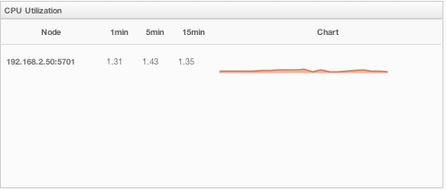
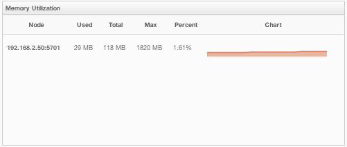

This is the first page appearing after logging in. It gives an overview of the connected cluster. The following subsections describe each portion of the page.

#### CPU Utilization

This part of the page provides load and utilization information for the CPUs for each cluster member, as shown below.

The first column lists the members with their IPs and ports. The next columns list the system load averages on each member for the last 1, 5 and 15 minutes. These average values are calculated as the sum of the count of runnable entities running on and queued to the available CPUs averaged over the last 1, 5 and 15 minutes. This calculation is operating system specific, typically a damped time-dependent average. If system load average is not available, these columns show negative values.

The last column (**Chart**) graphically shows the recent load on the CPUs. When you move the mouse cursor on a chart, you can see the CPU load at the time where the cursor is placed. Charts under this column shows the CPU loads approximately for the last 2 minutes. If recent CPU load is not available, you will see a negative value.

#### Memory Utilization

This part of the page provides information related to memory usages for each member, as shown below.

The first column lists the members with their IPs and ports. The next columns show the used and free memories out of the total memory reserved for Hazelcast usage, in real-time. The **Max** column lists the maximum memory capacity of each member and the **Percent** column lists the percentage value of used memory out of the maximum memory. The last column (**Chart**) shows the memory usage of members graphically. When you move the mouse cursor on a desired graph, you can see the memory usage at the time where the cursor is placed. Graphs under this column shows the memory usages approximately for the last 2 minutes.

#### Memory Distribution

This part of the page graphically provides the cluster wise breakdown of memory, as shown below. The blue area is the memory used by maps. The dark yellow area is the memory used by both non-Hazelcast entities and all Hazelcast entities except the map (i.e. the memory used by all entities subtracted by the memory used by map). The green area is the free memory out of the whole cluster`s memory capacity.

In the above example, you can see 0.32% of the total memory is used by Hazelcast maps (it can be seen by placing the mouse cursor on it), 58.75% is used by non-Hazelcast entities and 40.85% of the total memory is free.

#### Map Memory Distribution

This part is the breakdown of the blue area shown in the **Memory Distribution** graph explained above. It provides the percentage values of the memories used by each map, out of the total cluster memory reserved for all Hazelcast maps.

In the above example, you can see 49.55% of the total map memory is used by **map1** and 49.55% is used by **map2**.

#### Partition Distribution

This pie chart shows what percentage of partitions each cluster member has, as shown below.

You can see each member's partition percentages by placing the mouse cursor on the chart. In the above example, you can see the member "127.0.0.1:5708" has 5.64% of the total partition count (which is 271 by default and configurable, please see the `hazelcast.partition.count` property explained in the [System Properties section](25_System_Properties.md)).

