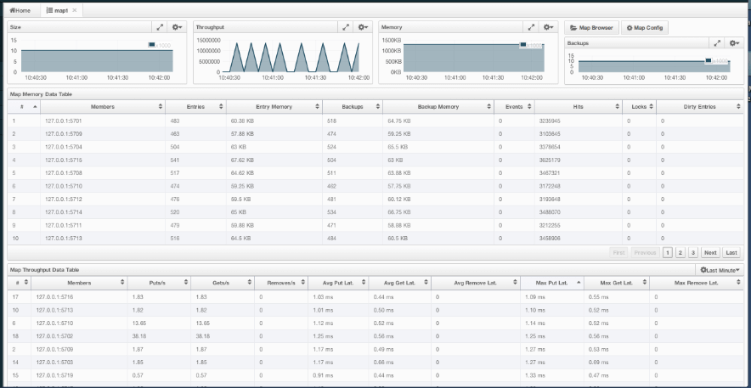
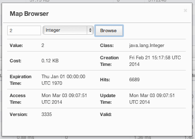
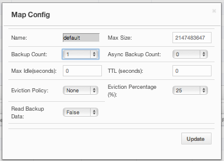
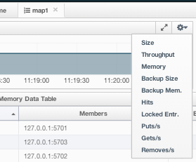

Map instances are listed under the **Maps** menu item on the left. When you click on a map, a new tab for monitoring that map instance opens on the right, as shown below. In this tab, you can monitor metrics and also re-configure the selected map.

The below subsections explain the portions of this window.

#### Map Browser

Use the Map Browser tool to retrieve properties of the entries stored in the selected map. To open the Map Browser tool, click on the **Map Browser** button, located at the top right of the window. Once opened, the tool appears as a dialog, as shown below.

Once the key and the key's type are specified and the **Browse** button is clicked, the key's properties along with its value are listed.

#### Map Config

Use the Map Config tool to set the selected map's attributes, such as the backup count, TTL, and eviction policy. To open the Map Config tool, click on the **Map Config** button, located at the top right of the window. Once opened, the tool appears as a dialog, as shown below.

You can change any attribute and click the **Update** button to save your changes.

#### Map Monitoring

Besides the Map Browser and Map Config tools, the map monitoring page has monitoring options that are explained below. All of these options perform real-time monitoring.

On top of the page, small charts monitor the size, throughput, memory usage, backup size, etc. of the selected map in real-time. The X-axis of all the charts show the current system time. You can select other small monitoring charts using the  button at the top right of each chart. When you click the button, the monitoring options are listed, as shown below.

When you click on a desired monitoring, the chart is loaded with the selected option. To open a chart as a separate dialog, click on the  button placed at the top right of each chart. The monitoring charts below are available:

-	**Size**: Monitors the size of the map. Y-axis is the entry count (should be multiplied by 1000).
-	**Throughput**: Monitors get, put and remove operations performed on the map. Y-axis is the operation count.
-	**Memory**: Monitors the memory usage on the map. Y-axis is the memory count.
-	**Backups**: Chart loaded when "Backup Size" is selected. Monitors the size of the backups in the map. Y-axis is the backup entry count (should be multiplied by 1000).
-	**Backup Memory**: Chart loaded when "Backup Mem." is selected. Monitors the memory usage of the backups. Y-axis is the memory count.
-	**Hits**: Monitors the hit count of the map.
-	**Puts/s, Gets/s, Removes/s**: These three charts monitor the put, get and remove operations (per second) performed on the selected map.

Under these charts are **Map Memory** and **Map Throughput** data tables. The Map Memory data table provides memory metrics distributed over members, as shown below.

From left to right, this table lists the IP address and port, entry counts, memory used by entries, backup entry counts, memory used by backup entries, events, hits, locks and dirty entries (in the cases where *MapStore* is enabled, these are the entries that are put to/removed from the map but not written to/removed from a database yet) of each entry in the map. You can navigate through the pages using the buttons at the bottom right of the table (**First, Previous, Next, Last**). You can ascend or descend the order of the listings by clicking on the column headings.

Map Throughput data table provides information about the operations (get, put, remove) performed on each member in the map, as shown below.

From left to right, this table lists:

- the IP address and port of each member,
- the put, get and remove operations on each member,
- the average put, get, remove latencies,
- and the maximum put, get, remove latencies on each member.

You can select the period in the combo box placed at the top right corner of the window, for which the table data will be shown. Available values are **Since Beginning**, **Last Minute**, **Last 10 Minutes** and **Last 1 Hour**.

You can navigate through the pages using the buttons placed at the bottom right of the table (**First, Previous, Next, Last**). To ascend or descent the order of the listings, click on the column headings.

