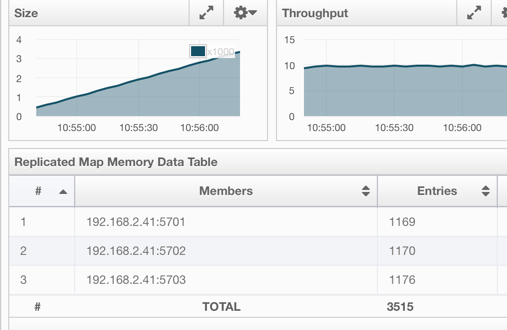

Replicated Map instances are shown under the **Replicated Maps** menu item on the left. When you click on a Replicated Map, a new tab for monitoring that instance opens on the right, as shown below.

In this tab, you can monitor metrics and also re-configure the selected Replicated Map. All of the statistics are real-time monitoring statistics.

When you click on a desired monitoring, the chart is loaded with the selected option. Also you can open the chart in new window.

-	**Size**: Monitors the size of the Replicated Map. Y-axis is the entry count (should be multiplied by 1000).
-	**Throughput**: Monitors get, put and remove operations performed on the Replicated Map. Y-axis is the operation count.
-	**Memory**: Monitors the memory usage on the Replicated Map. Y-axis is the memory count.
-	**Hits**: Monitors the hit count of the Replicated Map.
-	**Puts/s, Gets/s, Removes/s**: These three charts monitor the put, get and remove operations (per second) performed on the selected Replicated Map, the average put, get, remove latencies, and the maximum put, get, remove latencies on each member.

The Replicated Map Throughput Data Table provides information about operations (get, put, remove) performed on each member in the selected Replicated Map.

From left to right, this table lists:

- the IP address and port of each member,
- the put, get, and remove operations on each member,
- the average put, get, and remove latencies,
- and the maximum put, get, and remove latencies on each member.

You can select the period from the combo box placed at the top right corner of the window, in which the table data is shown. Available values are **Since Beginning**, **Last Minute**, **Last 10 Minutes** and **Last 1 Hour**.

You can navigate through the pages using the buttons placed at the bottom right of the table (**First, Previous, Next, Last**). To ascend or descent the order of the listings, click on the column headings.

