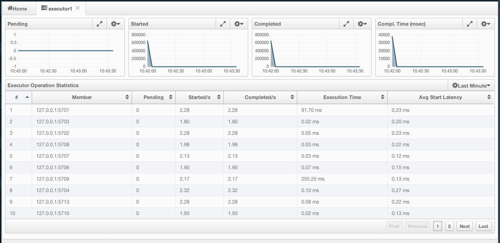
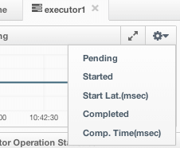

Executor instances are listed under the **Executors** menu item on the left. When you click on a executor, a new tab for monitoring that executor instance opens on the right, as shown below.

On top of the page, small charts monitor the pending, started, completed, etc. executors in real-time. The X-axis of all the charts shows the current system time. You can select other small monitoring charts using the  button placed at the top right of each chart. Click the button to list the monitoring options, as shown below.

When you click on a desired monitoring, the chart loads with the selected option. To open a chart as a separate dialog, click on the  button placed at top right of each chart. The below monitoring charts are available:

-	**Pending**: Monitors the pending executors. Y-axis is the executor count.
-	**Started**: Monitors the started executors. Y-axis is the executor count.
-	**Start Lat. (msec.)**: Shows the latency when executors are started. Y-axis is the duration in milliseconds.
-	**Completed**: Monitors the completed executors. Y-axis is the executor count.
-	**Comp. Time (msec.)**: Shows the completion period of executors. Y-axis is the duration in milliseconds.

Under these charts is the **Executor Operation Statistics** table, as shown below.

From left to right, this table lists the IP address and port of members, the counts of pending, started and completed executors per second, and the execution time and average start latency of executors on each member. You can navigate through the pages using the buttons placed at the bottom right of the table (**First, Previous, Next, Last**). Click on the column heading to ascend or descend the order of the listings.

