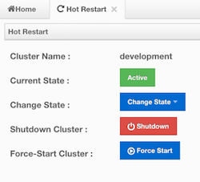
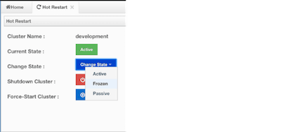
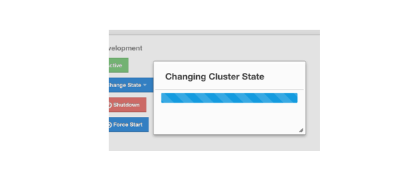
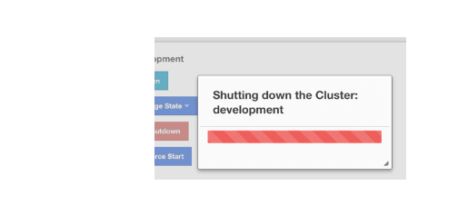
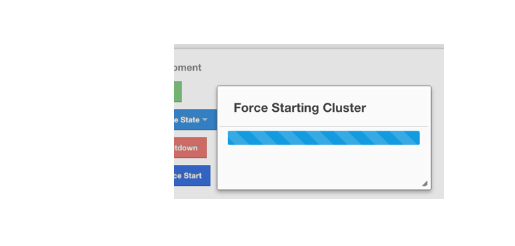

 ***NOTE:*** *This toolbar item is available only to admin users.*

The admin user can see and change the cluster state, shut down the cluster, and force start the cluster using the operations listed in this screen as shown below.

**Cluster States**

- **Active**: Cluster will continue to operate without any restriction. All operations are allowed. This is the default state of a cluster.

- **Frozen**: New members are not allowed to join, except the members left in **this** state or **Passive** state. All other operations except migrations are allowed and will operate without any restriction.

- **Passive**: New members are not allowed to join, except the members left in **this** state or **Frozen** state. All operations, except the ones marked with `AllowedDuringPassiveState`, will be rejected immediately.

- **In Transition**: Shows that the cluster state is in transition. This is a temporary and intermediate state. It is not allowed to set it explicitly.

**Changing Cluster State**

- Click the dropdown menu and choose the state to which you want your cluster to change. A pop-up will appear and stay on the screen until the state is successfully changed.

**Shutting Down the Cluster**

- Click the **Shutdown** button. A pop-up will appear and stay on screen until the cluster is successfully shutdown.

If an exception occurs during the state change or shutdown operation on the cluster, this exception message will be shown on the screen as a notification.

**Force Start the Cluster**

Restart process cannot be completed if a member crashes permanently and cannot recover from the failure since it cannot start or it fails to load its own data. In that case, you can force the cluster to clean its persisted data and make a fresh start. This process is called **force start**.

Click the **Force Start** button. A pop-up will appear and stay on screen until the operation is triggered.

If an exception occurs, this exception message will be showed on the screen as a notification.

 ***NOTE:*** *The operations explained in this section (Hot Restart) can also be performed using REST API and the script `cluster.sh`. Please refer to the [Using REST API for Cluster Management section](../03_Cluster_Utilities/03_Using_REST_API_for_Cluster_Management.md) and [Using the Script cluster.sh section](../03_Cluster_Utilities/02_Using_the_Script_cluster.sh.md).*

