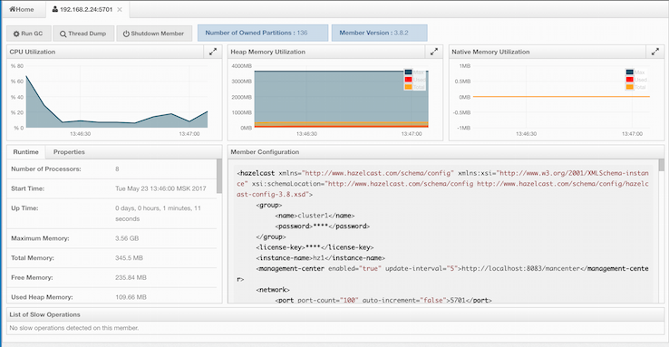
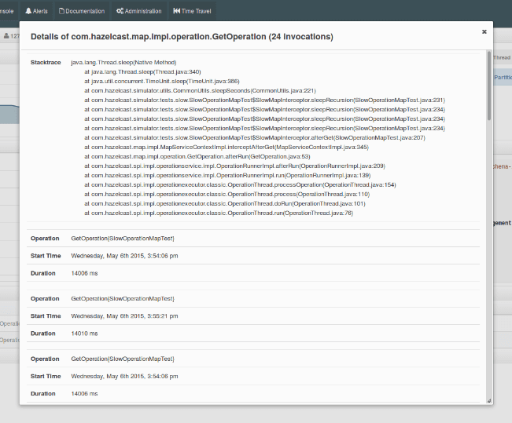

Use this menu item to monitor each cluster member and perform operations like running garbage collection (GC) and taking a thread dump. Once you select a member from the menu, a new tab for monitoring that member opens on the right, as shown below.

The **CPU Utilization** chart shows the percentage of CPU usage on the selected member. The **Memory Utilization** chart shows the memory usage on the selected member with three different metrics (maximum, used and total memory). You can open both of these charts as separate windows using the  button placed at top right of each chart; this gives you a clearer view of the chart.

The window titled **Partitions** shows which partitions are assigned to the selected member. **Runtime** is a dynamically updated window tab showing the processor number, the start and up times, and the maximum, total and free memory sizes of the selected member. These values are collected from the default MXBeans provided by the Java Virtual Machine (JVM). Descriptions from the Javadocs and some explanations are below:

- **Number of Processors**: Number of processors available to the member (JVM).

- **Start Time**: Start time of the member (JVM) in milliseconds.

- **Up Time**: Uptime of the member (JVM) in milliseconds

- **Maximum Memory**: Maximum amount of memory that the member (JVM) will attempt to use.

- **Free Memory**: Amount of free memory in the member (JVM).

- **Used Heap Memory**: Amount of used memory in bytes.

- **Max Heap Memory**: Maximum amount of memory in bytes that can be used for memory management.

- **Used Non-Heap Memory**: Amount of used memory in bytes.

- **Max Non-Heap Memory**: Maximum amount of memory in bytes that can be used for memory management.

- **Total Loaded Classes**: Total number of classes that have been loaded since the member (JVM) has started execution.

- **Current Loaded Classes**: Number of classes that are currently loaded in the member (JVM).

- **Total Unloaded Classes**: Total number of classes unloaded since the member (JVM) has started execution.

- **Total Thread Count**: Total number of threads created and also started since the member (JVM) started.

- **Active Thread Count**: Current number of live threads including both daemon and non-daemon threads.

- **Peak Thread Count**: Peak live thread count since the member (JVM) started or peak was reset.

- **Daemon Thread Count**: Current number of live daemon threads.

- **OS: Free Physical Memory**: Amount of free physical memory in bytes.

- **OS: Committed Virtual Memory**: Amount of virtual memory that is guaranteed to be available to the running process in bytes.

- **OS: Total Physical Memory**: Total amount of physical memory in bytes.

- **OS: Free Swap Space**: Amount of free swap space in bytes. Swap space is used when the amount of physical memory (RAM) is full. If the system needs more memory resources and the RAM is full, inactive pages in memory are moved to the swap space.

- **OS: Total Swap Space**: Total amount of swap space in bytes.

- **OS: Maximum File Descriptor Count**: Maximum number of file descriptors. File descriptor is an integer number that uniquely represents an opened file in the operating system.

- **OS: Open File Descriptor Count**: Number of open file descriptors.

- **OS: Process CPU Time**: CPU time used by the process on which the member (JVM) is running in nanoseconds.

- **OS: Process CPU Load**: Recent CPU usage for the member (JVM) process. This is a double with a value from 0.0 to 1.0. A value of 0.0 means that none of the CPUs were running threads from the member (JVM) process during the recent period of time observed, while a value of 1.0 means that all CPUs were actively running threads from the member (JVM) 100% of the time during the recent period being observed. Threads from the member (JVM) include the application threads as well as the member (JVM) internal threads.

- **OS: System Load Average**: System load average for the last minute. The system load average is the average over a period of time of this sum: (the number of runnable entities queued to the available processors) + (the number of runnable entities running on the available processors). The way in which the load average is calculated is operating system specific but it is typically a damped time-dependent average.

- **OS: System CPU Load**:
Recent CPU usage for the whole system. This is a double with a value from 0.0 to 1.0. A value of 0.0 means that all CPUs were idle during the recent period of time observed, while a value of 1.0 means that all CPUs were actively running 100% of the time during the recent period being observed.

 ***NOTE:*** *These descriptions may vary according to the JVM version or vendor.*

Next to the **Runtime** tab, the **Properties** tab shows the system properties. The **Member Configuration** window shows the XML configuration of the connected Hazelcast cluster.

The **List of Slow Operations** gives an overview of detected slow operations which occurred on that member. The data is collected by the [SlowOperationDetector](/19_Performance/03_Slow_Operation_Detector.md).

Click on an entry to open a dialog which shows the stacktrace and detailed information about each slow invocation of this operation.

Besides the aforementioned monitoring charts and windows, you can also perform operations on the selected member through this page. The operation buttons are located at the top right of the page, as explained below:

-	**Run GC**: Press this button to execute garbage collection on the selected member. A notification stating that the GC execution was successful will be shown.
-	**Thread Dump**: Press this button to take a thread dump of the selected member and show it as a separate dialog to the user.
-	**Shutdown Node**: Press this button to shutdown the selected member.
