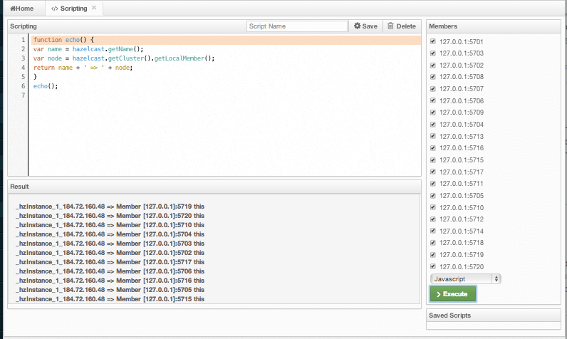

You can use the scripting feature of this tool to execute codes on the cluster. To open this feature as a tab, select **Scripting** located at the toolbar on top. Once selected, the scripting feature opens as shown below.



In this window, the **Scripting** part is the actual coding editor. You can select the members on which the code will execute from the **Members** list shown at the right side of the window. Below the members list, a combo box enables you to select a scripting language: currently, JavaScript, Ruby, Groovy and Python languages are supported. After you write your script and press the **Execute** button, you can see the execution result in the **Result** part of the window.

 ***NOTE:*** *To use the scripting languages other than JavaScript on a member, the libraries for those languages should be placed in the classpath of that member.*

There are **Save** and **Delete** buttons on the top right of the scripting editor. To save your scripts, press the **Save** button after you type a name for your script into the field next to this button. The scripts you saved are listed in the **Saved Scripts** part of the window, located at the bottom right of the page. Click on a saved script from this list to execute or edit it. If you want to remove a script that you wrote and saved before, select it from this list and press the **Delete** button.

In the scripting engine you have a `HazelcastInstance` bonded to a variable named `hazelcast`. You can invoke any method that `HazelcastInstance` has via the `hazelcast` variable. You can see example usage for JavaScript below.

```javascript
var name = hazelcast.getName();
var node = hazelcast.getCluster().getLocalMember();
var employees = hazelcast.getMap("employees");
employees.put("1","John Doe");
employees.get("1"); // will return "John Doe"
```
