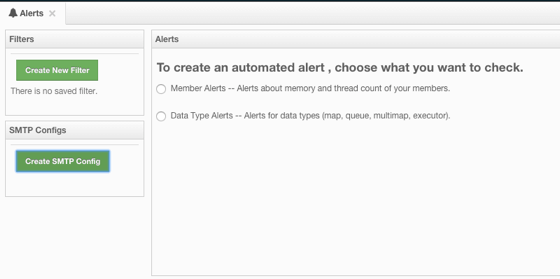
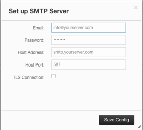
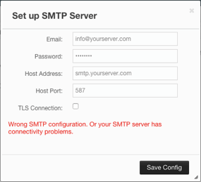
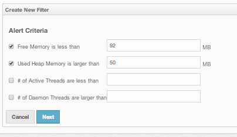
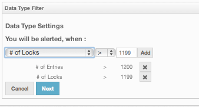

You can use the alerts feature of this tool to receive alerts and/or e-mail notifications by creating filters. In these filters, you can specify criteria for cluster members or data structures. When the specified criteria are met for a filter, the related alert is shown as a pop-up message on the top right of the page or sent as an e-mail.

Once you click the **Alerts** button located on the toolbar, the page shown below appears.

If you want to enable the Management Center to send e-mail notifications to the Management Center Admin users, you need to configure the SMTP server. To do this, click on the **Create STMP Config** shown above. The form shown below appears.

In this form, specify the e-mail address from which the notifications will be sent and also its password. Then, provide the SMTP server host address and port. Finally, check the **TLS Connection** checkbox if the connection is secured by TLS (Transport Layer Security).

After you provide the required information, click on the **Save Config** button. After a processing period (for a couple of seconds), the form will be closed if the configuration is created successfully. In this case, an e-mail will be sent to the e-mail address you provided in the form stating that the SMTP configuration is successful and e-mail alert system is created.

If not, you will see an error message at the bottom of this form as shown below.   

As you can see, the reasons can be wrong SMTP configuration or connectivity problems. In this case, please check the form fields and check for any causes for the connections issues with your server.

**Creating Filters for Cluster Members**

Select **Member Alerts** check box to create filters for some or all members in the cluster. Once selected, the next screen asks for which members the alert will be created. Select the desired members and click on the **Next** button. On the next page (shown below), specify the criteria.

You can create alerts when:

-	free memory on the selected members is less than the specified number.
-	used heap memory is larger than the specified number.
-	the number of active threads are less than the specified count.
-	the number of daemon threads are larger than the specified count.

When two or more criteria is specified they will be bound with the logical operator **AND**.

On the next page, give a name for the filter. Then, select whether notification e-mails will be sent to the Management Center Admins using the **Send Email Alert** checkbox. Then, provide a time interval (in seconds) for which the e-mails with the **same notification content** will be sent using the **Email Interval (secs)** field.  Finally, select whether the alert data will be written to the disk (if checked, you can see the alert log at the folder */users/<your user>/mancenter<version>*).

Click on the **Save** button; your filter will be saved and put into the **Filters** part of the page. To edit the filter, click on the  icon. To delete it, click on the  icon.

**Creating Filters for Data Types**

Select the **Data Type Alerts** check box to create filters for data structures. The next screen asks for which data structure (maps, queues, multimaps, executors) the alert will be created. Once a structure is selected, the next screen immediately loads and you then select the data structure instances (i.e. if you selected *Maps*, it will list all the maps defined in the cluster, you can select one map or more). Select as desired, click on the **Next** button, and select the members on which the selected data structure instances will run.

The next screen, as shown below, is the one where you specify the criteria for the selected data structure.

As the screen shown above shows, you will select an item from the left combo box, select the operator in the middle one, specify a value in the input field, and click on the **Add** button. You can create more than one criteria in this page; those will be bound by the logical operator **AND**.

After you specify the criteria, click the **Next** button. On the next page, give a name for the filter. Then, select whether notification e-mails will be sent to the Management Center Admins using the **Send Email Alert** checkbox. Then, provide a time interval (in seconds) for which the e-mails with the **same notification content** will be sent using the **Email Interval (secs)** field.  Finally, select whether the alert data will be written to the disk (if checked, you can see the alert log at the folder */users/<your user>/mancenter<version>*).

Click on the **Save** button; your filter will be saved and put into the **Filters** part of the page. To edit the filter, click on the  icon. To delete it, click on the  icon.

