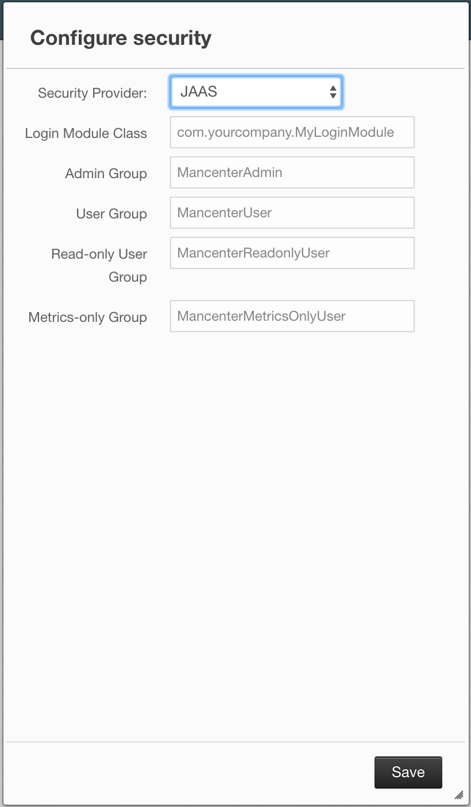

You can use your own `javax.security.auth.spi.LoginModule` implementation for authentication/authorization on Management Center. In the "Configure Security" page, select **JAAS** from the "Security Provider" combo box, and the following page appears:



Provide the details in this form for your JAAS `LoginModule` implementation:

- **Login Module Class**: Fully qualified class name of your `javax.security.auth.spi.LoginModule` implementation
- **Admin Group:** Members of this group will have admin privileges on the Management Center.
- **User Group:** Members of this group will have read and write privileges on the Management Center.
- **Read-only User Group:** Members of this group will have only read privilege on the Management Center.
- **Metrics-only Group:** Members of this group will have the privilege to see only the metrics on the Management Center.

Following is an example implementation. Note that we return two `java.security.Principal` instances; one of them is the username and the other one is a group name, which you will use when configuring JAAS security as described above.

```java
import javax.security.auth.Subject;
import javax.security.auth.callback.Callback;
import javax.security.auth.callback.CallbackHandler;
import javax.security.auth.callback.NameCallback;
import javax.security.auth.callback.PasswordCallback;
import javax.security.auth.login.LoginException;
import javax.security.auth.spi.LoginModule;
import java.security.Principal;
import java.util.Map;
 
public class SampleLoginModule implements LoginModule {
    private Subject subject;
    private String password;
    private String username;
 
    @Override
    public void initialize(Subject subject, CallbackHandler callbackHandler, Map<String, ?> sharedState, Map<String, ?> options) {
        this.subject = subject;
 
        try {
            NameCallback nameCallback = new NameCallback("prompt");
            PasswordCallback passwordCallback = new PasswordCallback("prompt", false);
 
            callbackHandler.handle(new Callback[] {nameCallback, passwordCallback });
 
            password = new String(passwordCallback.getPassword());
            username = nameCallback.getName();
        } catch (Exception e) {
            throw new RuntimeException(e);
        }
    }
 
    @Override
    public boolean login() throws LoginException {
        if (!username.equals("emre")) {
            throw new LoginException("Bad User");
        }
 
        if (!password.equals("pass1234")) {
            throw new LoginException("Bad Password");
        }
 
        subject.getPrincipals().add(new Principal() {
            public String getName() {
                return "emre";
            }
        });
        
        subject.getPrincipals().add(new Principal() {
            public String getName() {
                return "MancenterAdmin";
            }
        });
        
        return true;
    }
        
    @Override
    public boolean commit() throws LoginException {
        return true;
    }

    @Override
    public boolean abort() throws LoginException {
        return true;
    }

    @Override
    public boolean logout() throws LoginException {
        return true;
    }
}
```