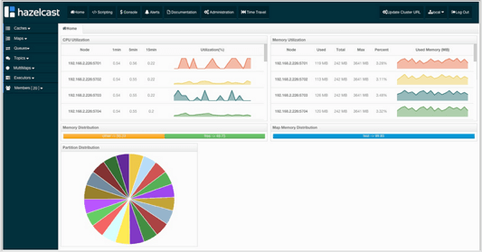
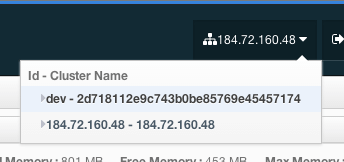
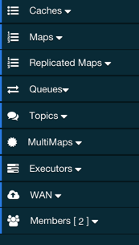

Once the page is loaded after selecting a cluster, the tool's home page appears as shown below.

This page provides the fundamental properties of the selected cluster which are explained in the [Home Page](04_Home_Page.md) section. The page has a toolbar on the top and a menu on the left.

#### Toolbar

The toolbar has the following buttons:

-	**Home**: Loads the home page shown above. Please see the [Management Center Home Page section](04_Home_Page.md).
-	**Scripting**: Loads the page used to write and execute the user`s own scripts on the cluster. Please see the [Scripting section](14_Scripting.md).
-	**Console**: Loads the page used to execute commands on the cluster. Please see the [Console section](15_Executing_Console_Commands.md).
-	**Alerts**: Creates alerts by specifying filters. Please see the [Setting Alerts section](16_Creating_Alerts.md).
-	**Documentation**: Opens the Management Center documentation in a window inside the tool. Please see the [Documentation section](20_Management_Center_Documentation.md).
-	**Administration**: Used by the admin users to manage users in the system. Please see the [Administering Management Center section](17_Administering_Management_Center.md).
-	**Logout**: Closes the current user's session.
-	**Hot Restart**: Used by the admin users to manage cluster state. Please see the [Hot Restart section](18_Hot_Restart.md).
-	**Time Travel**: Sees the cluster's situation at a time in the past. Please see the [Time Travel section](19_Checking_Past_Status_with_Time_Travel.md).
-	**Cluster Selector**: Switches between clusters. When the mouse is moved onto this item, a drop down list of clusters appears.

  

  The user can select any cluster and once selected, the page immediately loads with the selected cluster's information.

 ***NOTE:*** *Some of the above listed toolbar items are not visible to users who are not admin or who have **read-only** permission. Also, some of the operations explained in the later sections cannot be performed by users with read-only permission. Please see the [Administering Management Center section](17_Administering_Management_Center.md) for details.*

#### Menu

The Home Page includes a menu on the left which lists the distributed data structures in the cluster and all the cluster members, as shown below.

 ***NOTE:*** *Distributed data structures will be shown there when the proxies are created for them.*

 ***NOTE:*** *WAN Replication tab is only visible with **Hazelcast IMDG Enterprise** license.*

You can expand and collapse menu items by clicking on them. Below is the list of menu items with links to their explanations.

-	[Caches](05_Monitoring_Caches.md)
-	[Maps](06_Managing_Maps.md)
- [Replicated Maps](07_Monitoring_Replicated_Maps.md)
-	[Queues](08_Monitoring_Queues.md)
-	[Topics](09_Monitoring_Topics.md)
-	[MultiMaps](10_Monitoring_MultiMaps.md)
-	[Executors](11_Monitoring_Executors.md)
- [WAN](12_Monitoring_WAN_Replication.md)
-	[Members](13_Monitoring_Members.md)

#### Tabbed View

Each time you select an item from the toolbar or menu, the item is added to the main view as a tab, as shown below.

In the above example, *Home*, *Scripting*, *Console*, *queue1* and *map1* windows can be seen as tabs. Windows can be closed using the  icon on each tab (except the Home Page; it cannot be closed).

