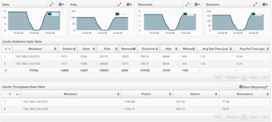

You can monitor your caches' metrics by clicking the cache name listed on the left panel under **Caches** menu item. A new tab for monitoring that cache instance is opened on the right, as shown below.

On top of the page, four charts monitor the **Gets**, **Puts**, **Removals** and **Evictions** in real-time. The X-axis of all the charts show the current system time. To open a chart as a separate dialog, click on the  button placed at the top right of each chart.

Under these charts is the Cache Statistics Data Table. From left to right, this table lists the IP addresses and ports of each member, and the entry, get, put, removal, eviction, and hit and miss counts per second in real-time.

You can navigate through the pages using the buttons at the bottom right of the table (**First, Previous, Next, Last**). You can ascend or descend the order of the listings in each column by clicking on column headings.

Under the Cache Statistics Data Table, there is Cache Throughput Data Table.

From left to right, this table lists:

- the IP address and port of each member,
- the put/s, get/s and remove/s operation rates on each member.

You can select the period in the combo box placed at the top right corner of the window, for which the table data will be shown. Available values are **Since Beginning**, **Last Minute**, **Last 10 Minutes** and **Last 1 Hour**.

 ***NOTE:*** *You need to enable the statistics for caches to monitor them in the Management Center. Use the `<statistics-enabled>` element or `setStatisticsEnabled()` method in declarative or programmatic configuration, respectively, to enable the statistics. Please refer to the [JCache Declarative Configuration section](/11_Hazelcast_JCache/01_Setup_and_Configuration/02_Configuring_for_JCache.md) for more information.*

