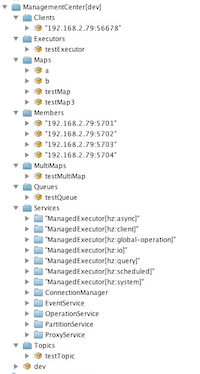

<font color="#3981DB">**Hazelcast IMDG Enterprise**</font>
<br></br>


Clustered JMX via Management Center allows you to monitor clustered statistics of distributed objects from a JMX interface.

### Configuring Clustered JMX


In order to configure Clustered JMX, use the following command line parameters for your Management Center deployment.

- `-Dhazelcast.mc.jmx.enabled=true` (default is false)
- `-Dhazelcast.mc.jmx.port=9000` (optional, default is 9999)
- `-Dcom.sun.management.jmxremote.ssl=false`

With embedded Jetty, you do not need to deploy your Management Center application to any container or application server.

You can start Management Center application with Clustered JMX enabled as shown below.

```
java -Dhazelcast.mc.jmx.enabled=true -Dhazelcast.mc.jmx.port=9999 -Dcom.sun.management.jmxremote.ssl=false -jar mancenter-3.3.jar
```

Once Management Center starts, you should see a log similar to below.

```
INFO: Management Center 3.3
Jun 05, 2014 11:55:32 AM com.hazelcast.webmonitor.service.jmx.impl.JMXService
INFO: Starting Management Center JMX Service on port :9999
```

You should be able to connect to Clustered JMX interface from the address `localhost:9999`.

You can use `jconsole` or any other JMX client to monitor your Hazelcast Cluster. As a sample, below is the `jconsole` screenshot of the Clustered JMX hierarchy.




### Enabling TLS/SSL for Clustered JMX

By default, Clustered JMX is served unencrypted. To enable TLS/SSL for Clustered JMX, use the following command line 
parameters for your Management Center deployment.

- `-Dhazelcast.mc.jmx.ssl=true` (default is false) 
- `-Djavax.net.ssl.keyStore=path to your keyStore`
- `-Djavax.net.ssl.keyStorePassword=password for your keyStore`

Following is an example on how to start Management Center with a TLS/SSL enabled Clustered JMX service on port 65432:

```bash
java -Dhazelcast.mc.jmx.enabled=true -Dhazelcast.mc.jmx.port=65432 -Dhazelcast.mc.jmx.ssl=true -Djavax.net.ssl.keyStore=/some/dir/selfsigned.jks -Djavax.net.ssl.keyStorePassword=yourpassword -jar mancenter-3.8.1.war 
```

Then you can use the following command to connect to the Clustered JMX service using JConsole with address `localhost:65432`:

```bash
jconsole -J-Djavax.net.ssl.trustStore=/some/dir/selftrusted.ts -J-Djavax.net.ssl.trustStorePassword=trustpass
```
