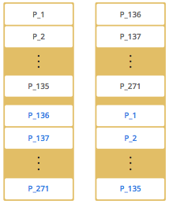
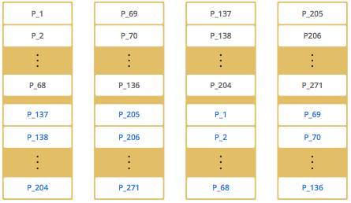

As you read in the [Sharding in Hazelcast section](00_Sharding_In_Hazelcast.md), Hazelcast shards are called Partitions. Partitions are memory segments that can contain hundreds or thousands of data entries each, depending on the memory capacity of your system. Each Hazelcast partition can have multiple replicas, which are distributed among the cluster members. One of the replicas becomes the `primary` and other replicas are called `backups`. Cluster member which owns `primary` replica of a partition is called `partition owner`. When you read or write a particular data entry, you transparently talk to the owner of the partition that contains the data entry.

By default, Hazelcast offers 271 partitions. When you start a cluster with a single member, it owns all of 271 partitions (i.e., it keeps primary replicas for 271 partitions). The following illustration shows the partitions in a Hazelcast cluster with single member.

When you start a second member on that cluster (creating a Hazelcast cluster with two members), the partition replicas are distributed as shown in the illustration here.

In the illustration, the partition replicas with black text are primaries and the partition replicas with blue text are backups. The first member has primary replicas of 135 partitions (black), and each of these partitions are backed up in the second member (i.e., the second member owns the backup replicas) (blue). At the same time, the first member also has the backup replicas of the second member's primary partition replicas.

As you add more members, Hazelcast moves some of the primary and backup partition replicas to the new members one by one, making all members equal and redundant. Thanks to the consistent hashing algorithm, only the minimum amount of partitions will be moved to scale out Hazelcast. The following is an illustration of the partition replica distributions in a Hazelcast cluster with four members.

Hazelcast distributes partitions' primary and backup replicas equally among the members of the cluster. Backup replicas of the partitions are maintained for redundancy.

 ***NOTE:*** *Your data can have multiple copies on partition primaries and backups, depending on your backup count. Please see the [Backing Up Maps section](/06_Distributed_Data_Structures/00_Map/01_Backing_Up_Maps.md).*

Partition distributions in the above illustrations are for your convenience and descriptive purposes. Normally, the partitions are not distributed in any order (as they are shown in these illustrations), but are distributed randomly. The important point here is that Hazelcast equally distributes the partition primaries and their backup replicas among the members.

Starting with Hazelcast 3.6, lite members are introduced. Lite members are a new type of members that do not own any partition. Lite members are intended for use in computationally-heavy task executions and listener registrations. Although they do not own any partitions,
they can access partitions that are owned by other members in the cluster.

  
***RELATED INFORMATION***

*Please refer to the [Enabling Lite Members section](/17_Management/03_Cluster_Utilities/04_Enabling_Lite_Members.md).*
   

### How the Data is Partitioned

Hazelcast distributes data entries into the partitions using a hashing algorithm. Given an object key (for example, for a map) or an object name (for example, for a topic or list):

- the key or name is serialized (converted into a byte array),
- this byte array is hashed, and
- the result of the hash is mod by the number of partitions.

The result of this modulo - *MOD(hash result, partition count)* -  is the partition in which the data will be stored, that is the **partition ID**. For ALL members you have in your cluster, the partition ID for a given key will always be the same.

### Partition Table

When you start a member, a partition table is created within it. This table stores the partition IDs and the cluster members to which they belong. The purpose of this table is to make all members (including lite members) in the cluster aware of this information, making sure that each member knows where the data is.

The oldest member in the cluster (the one that started first) periodically sends the partition table to all members. In this way each member in the cluster is informed about any changes to partition ownership. The ownerships may be changed when, for example, a new member joins the cluster, or when a member leaves the cluster.

 ***NOTE:*** *If the oldest member of the cluster goes down, the next oldest member sends the partition table information to the other ones.*

You can configure the frequency (how often) that the member sends the partition table the information by using the `hazelcast.partition.table.send.interval` system property. The property is set to every 15 seconds by default. 

### Repartitioning

Repartitioning is the process of redistribution of partition ownerships. Hazelcast performs the repartitioning in the following cases:

- When a member joins to the cluster.
- When a member leaves the cluster.

In these cases, the partition table in the oldest member is updated with the new partition ownerships. 

Note that if a lite member joins or leaves a cluster, repartitioning is not triggered since lite members do not own any partitions.

